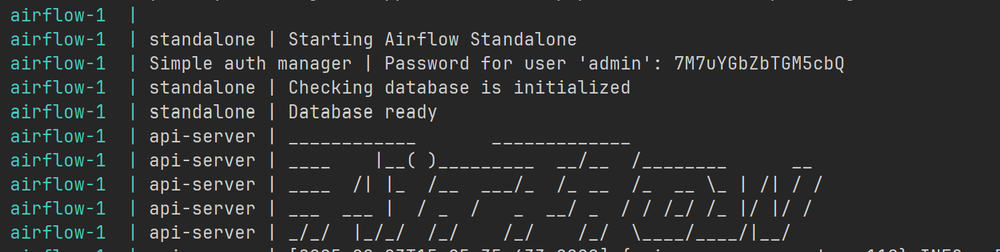

# Appointments ETL pipeline

## Overview
This repository contains a small ETL pipeline that
ingests raw appointment CSV files, validates and standardizes them, 
aggregates daily appointment counts per clinic, and writes the results 
to SQLite. 

## What it does
- Checks a source folder for new CSV files with appointments data.
- Validates schema and performs data-quality checks:
  - Required columns present
  - Valid datetimes
  - Non-missing values in required coumns
  - No duplicate values
  - Reasonable date range
- Transforms and standardizes
- Aggregates:
  - Daily appointments per clinic 
- Writes results to SQLite.
- Sends a notification in case of warning or error.
- Tracks file processing status to ensure idempotency and safe re-runs.

## Tech stack
- Orchestration: Apache Airflow
- Storage: SQLite
- Processing: Python, pandas
- Tests: pytest
- Containerization: Docker

## Solution structure
- dags/: Airflow DAG
- scripts/: ETL logic (read/validate/transform/write)
- appointments_data/: Drop your input CSV files here (on host; read-only in container)
- data/: SQLite database output (persisted via volume)
- logs/: Airflow logs
- docker-compose.yml: Containerized runtime for Airflow

## How to run
1) Clone the repository
2) Create a directory named "appointments_data" in the root and place your CSV files there.
3) Run Airflow in Docker:
   - Open Docker Desktop.
   - Start Airflow in the background. (The first run may take a bit to pull the image.):
        `docker compose up -d`
4) Open Airflow UI
   - Prepare your credentials for the Airflow UI:
   check the logs `docker compose logs -f airflow`. On the very top you will find 
   the username and password.
   
   Alternatively, you can find the username and password in docker files under path:
 /opt/airflow/simple_auth_manager_passwords.json.generate
   - Visit http://localhost:8080.
5) Trigger the pipeline
   - In Airflow UI, locate the DAG named "daily_appointments_count_aggregation".
   - Click “Play/Trigger” to start a run.
   - The DAG will:
     - Detect new files in appointments_data/
     - Short-circuit if there are no new files
     - Process each file, writing transformed data to SQLite

6) Inspect outputs
   - SQLite files are written under ./data on your host (mounted into the container).
   - You can explore the DB with any SQLite browser.
   - In case of error, check the notifications in the inbox on: https://webhook.site/#!/view/03075537-a273-451c-8f97-da4952dc434f/be24dbaa-db6f-4301-8c2a-2c36a175eb6e/1 under "Request Content."

7) Stop Docker and Airflow
   - `docker compose down`

## Alternative option to run locally
- A main file is included in the repository for testing/running locally.
- Replace the DB_PATH with a path to a local SQLite database in db.py and 
finding_unprocessed_files.py.
- Make sure that "appointments_data" folder is located in the same directory as main.py.
- Install pandas `pip install pandas`
- In files: db.py and finding_unprocessed_files.py uncomment the local path variables.
- Run `python main.py`

## Design notes
- On the first run a database is created with two tables: 

**clinic_daily_counts**

| clinic_id | appointment_date | appointment_count |
|-----------|------------------|-------------------|
| clinic_a  | 2023-09-01       | 4 |
| clinic_b  | 2023-09-01       | 3 |
and **processed_files**

| filename  | processed_date | status     |
|-----------|--------------|------------|
| file1.csv | 2025-09-01   | Processed  |
| file1.csv | 2025-09-02   | Failed     |
| file1.csv | 2025-09-03   | Processed  |

- This helps to ensure that only new files are processed every time the DAG is triggered.
- For easy inspecting of potential failures - a status is being assigned to each file 
and written to the helper table.
- For local runs webhook.site used as a dummy notification endpoint - it requires no credentials and makes it easy to verify that the DAG sends alerts. 

## What can go wrong
- Timestamp issues:
  - If the date in the file is missing a component (ex: day or month), it will be interpreted as 01 for the day or month.
- Large files:
  - Loading very large CSVs at once can cause high memory usage.
- Idempotency/processing state:
  - Files previously processed are skipped; if a corrupt file is replaced in the 
folder with the same name - it won't be processed again.
  - If data for the same day is released in two different files - writing to the DB will fail due to a unique constraint.
  If the situation like this is expected, logic can be improved to handle this case.

    
## What can be improved
- **Scalability and storage:** Migrate from SQLite to Postgres.
- **Performance:** Read CSVs in chunks.
- **Orchestration:** Add success or on-failure notifications (Slack/email).
- **Configuration:** Externalize all paths via environment variables.
